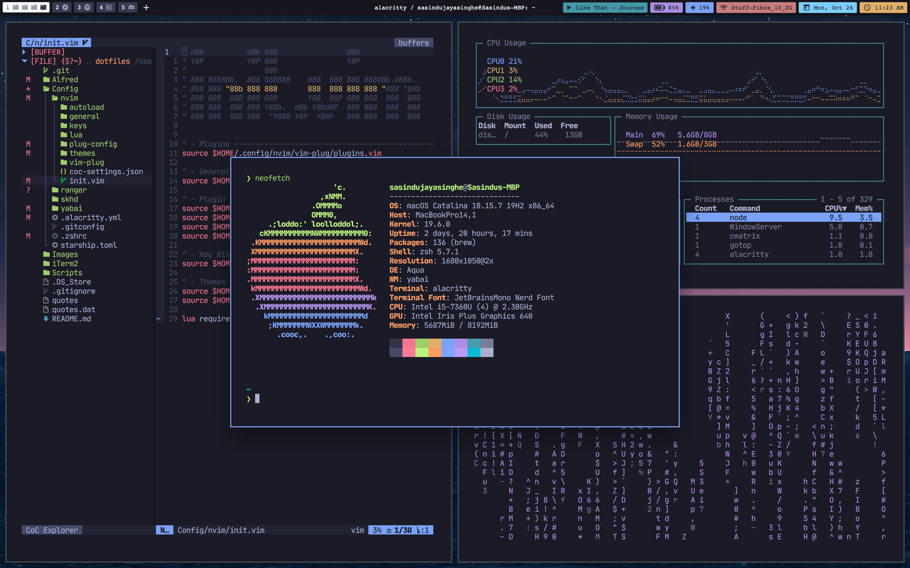

# macOS Dotfiles
This repo contains a number of configuration files that I use as well as
a Homebrew setup script for macOS that automates the installation process
for a number of applications.

## Contents:

**Configuration Files:**
- zsh
- Neovim
- iTerm2
- Yabai
- skhd
- coc

**Other Files:**
- macOS Setup Script

## Images

## Installation / Setup

`TODO: Setup / Installation instructions`

