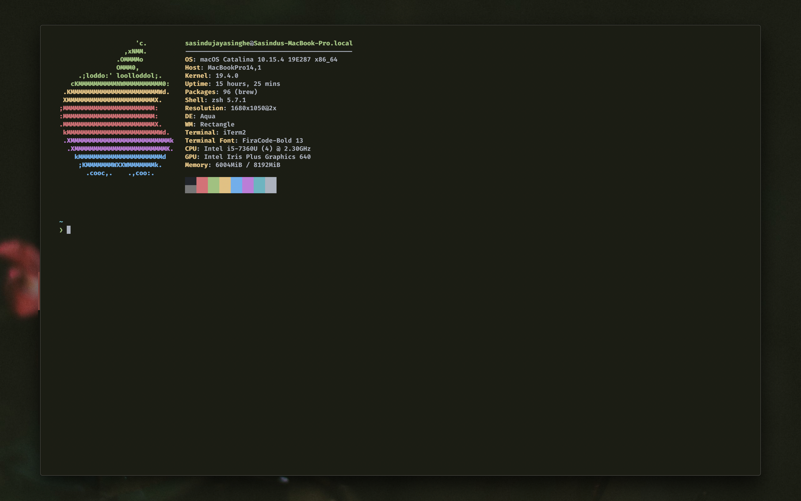

# macOS Dotfiles
This repo contains a number of configuration files that I use as well as
a Homebrew setup script for macOS that automates the installation process
for a number of applications.

## Contents:

**Configuration Files:**
- Zsh Runtime Configuration
- Vim Runtime Configuration
- Nano Runtime Configuration
- iTerm2 JSON Profile Configuration

**Setup Files:**
- macOS Setup Script
- Homebrew Update Script

## Images

**Desktop**

**iTerm2**

**Neovim**

`TODO: Setup Neovim and insert image here`

## Installation / Setup

`TODO: Setup / Installation instructions`